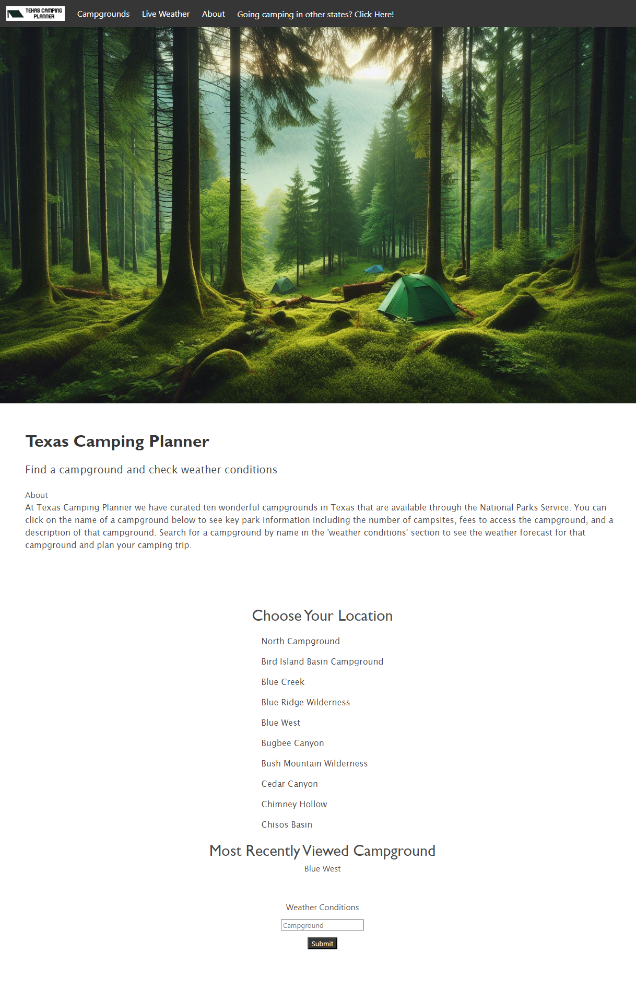

# <Camping-Planner>

## Description

This is a group project for the UT Coding Bootcamp. The objective of our project was to create a camping planner application that allows the user to read about available amenities at our featured national park campgrounds, and to check the weather at those locations. The user can also see a reminder of their most recently viewed campground to pick up where they left off in their camping trip planning. The project allowed the group to practice javascript skills including fetch requests, storing/retrieving data from local storage, use of modals, and dynamically inserting elements onto the page. The group was also able to practicethe use of a CSS library for styling and screen responsiveness concepts.

## Installation

There is no installation required. The application runs in the browser.

## Usage

Use the links in the navigation bar to navigate to the various sections of the page. Select a featured campground in the "Choose Your Location" section to see the ameninties available there. Search for a campground by name in the 'Weather Conditions' section to see the weather for that campground. When the page is refreshed the user will see the name of the campground they last viewed. The website is accessible at the following URL: https://victoria-cg.github.io/Texas-Camping-Planner/. See the screenshot below for a visual representation of the website.

## Credits

Image for Navigation Bar:
Original image designed by Bryson Cox

Image for Hero section:
Microsoft Copilot Powered by DALL-E 3. (2024). [Image of a green forest with a camping tent] [Graphic art]. Retrieved February 12, 2024, from Copilot interface.

README Template:
EdX. (2023, November 14). Professional README Guide | The Full-Stack Blog. Request-Response: The Full-Stack Blog. Retrieved February 7, 2024, from https://coding-boot-camp.github.io/full-stack/github/professional-readme-guide

Reference for use of modals:
W3 Schools. (1993-2024). How To Make a Modal Box With CSS and JavaScript. W3Schools. Retrieved February 8, 2024, from https://www.w3schools.com/howto/howto_css_modals.asp

Reference for use of modals with Bulma CSS library:
Thomas, J. (n.d.). Modal. Bulma. Retrieved February 8, 2024, from https://bulma.io/documentation/components/modal/

Reference for use of arrays and localStorage:
Kirupa. (2012, November 5). Storing and Retrieving an Array from Local Storage | kirupa.com. KIRUPA. Retrieved February 13, 2024, from https://www.kirupa.com/html5/storing_and_retrieving_an_array_from_local_storage.htm

Weather API used:

OpenWeather. (2012-2024). OpenWeather. Сurrent weather and forecast - OpenWeatherMap. Retrieved February 12, 2024, from https://openweathermap.org/

National Parks API used for park data: 

US National Park Service. (2017, August 15). API Documentation - Developer Resources, U.S. National Park Service. Retrieved February 12, 2024, from https://www.nps.gov/subjects/developer/api-documentation.htm#/thingstodo

Collaboration:

This project was a collaboration between UT Coding Bootcamp students Benjamin Brechter, Carolina Ochoa, Bryson Cox, Victoria Greenwood, and David Oweh.

Collaboration/debugging assistance provided:

Class instructor Torre Taylor assisted with debugging the CSS and HTML for displayin the hero image correctly: CSS line 7 and HTML lines 8-19.

Class TA Tye Stanley assisted with advice to hard code the modal feature in CSS rather than using via Bulma library due to bugs.

Carolina Ochoa's brother, Andres Ochoa, assisted with use of Chrome DevTools features for debugging javascript.

XPert AI Learning Assistant used for debugging assistance with local storage.

## License

Refer to the MIT license in the license section of the repository.
